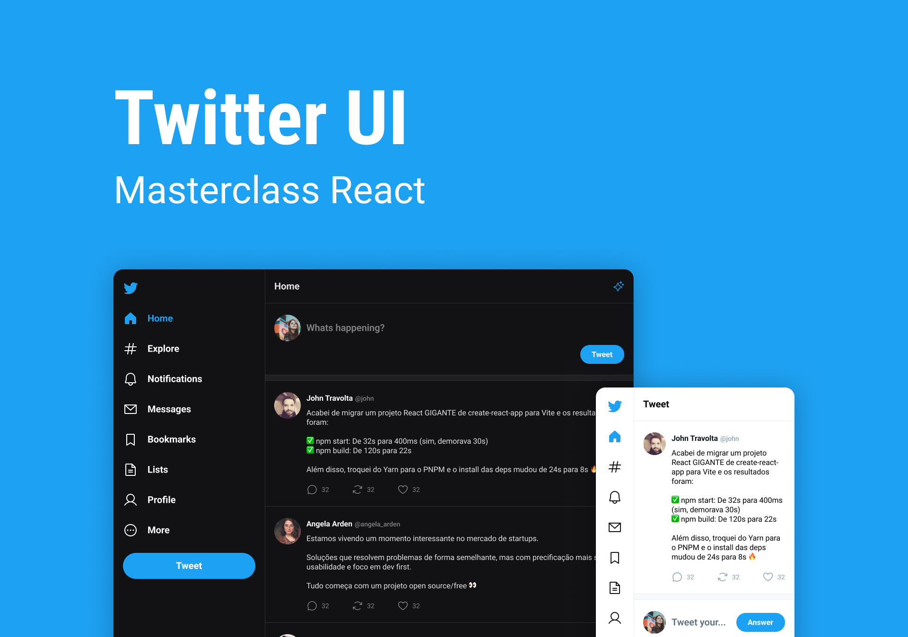

<h1 align="center">Masterclass | Clone UI Twitter</h1>

This project is a clone ui project.

  

## :writing_hand: Author:

- Nicolas Loffi Kaminski

## :rocket: Technologies:

- HTML e CSS
- JavaScript
- React
- Typescript
- Git e GitHub

## :art: Project:

The project <b>Masterclass | Clone UI Twitter</b> is a twitter social network clone.

## Layout:

Get the project layout through [THIS LINK](https://www.figma.com/community/file/1202694130789327431/Twitter-UI). You need an account on [Figma](https://figma.com) to access.
